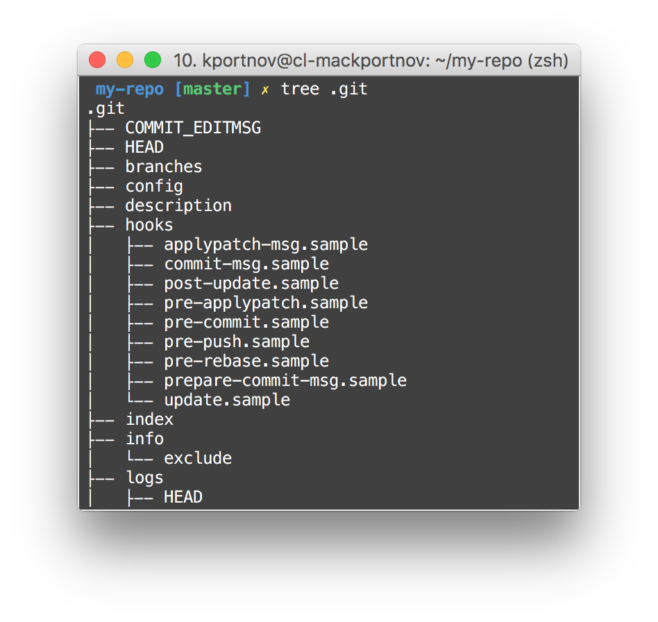
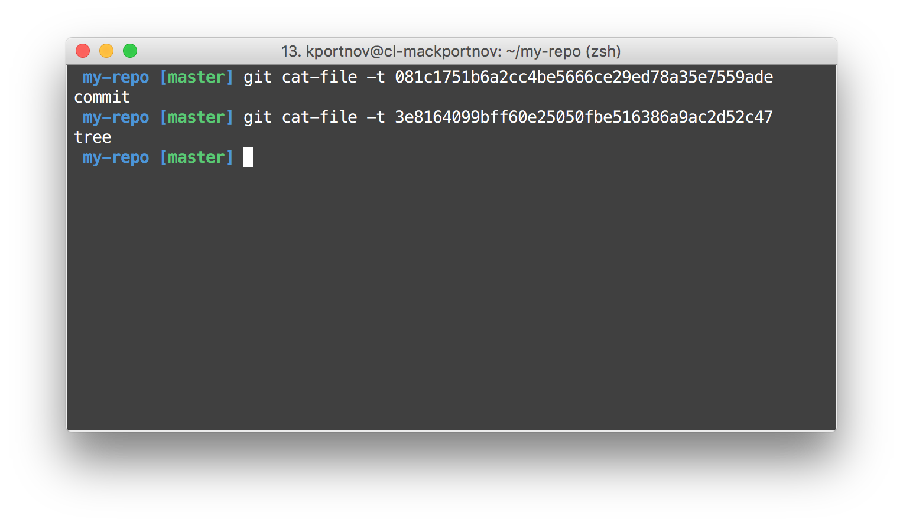
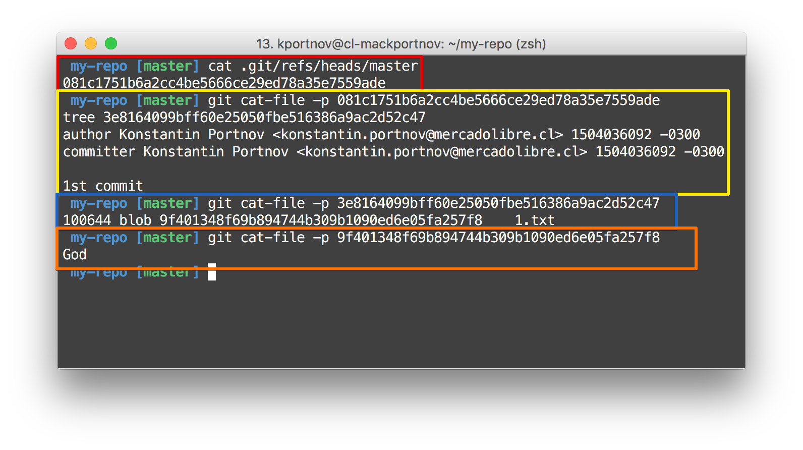

autoscale: true  
slidenumbers: true  
theme: Next, 3

# [fit] Git
# [fit] Under the Hood[^*]

<br/>

```swift
let author = "Konstantin Portnov"
let github = "github.com/x0000ff"
```


[^*]: https://octodex.github.com/bear-cavalry

---

# ¿Git?


---


---

# Hello, Empty World


> Install tree command[^0]

[^0]: On Mac : http://bit.ly/2xKh0PX

---

# [fit] ".git"?

---


---

# `"config"` it is a...
# config 😮


---

# Captain Hook!


---

# 🙈🙉🙊


Explicit repository excludes[^1]

[^1]: http://bit.ly/1Poywz1

---

# `"HEAD"`

## It's simple text file!


---

# On `"master"`?


---

# But `"master" doesn't exist`
# Paradox!


---

# " In the beginning was the Word..."


---


---

# No one change! 😭

Because Git doesn't know about our file

---

# `"add"`


---

# `"add"`


---


---

# Who are you "9f" and "401348"?


> Folder "9f" and file "401348f69b894744b309b1090ed6e05fa257f8"[^2]

[^2]: 10.2 Git Internals - Git Objects: http://bit.ly/2xK9Hb1

---

# But if we add another file with the same content?
# 🤔

---

## Hash doesn't depend of time, OS, localization and so on.
## 😬

---

# And inside we have...


---

# Swiss knife "cat-file"


---

# ¿Blob?


> Blob: "an object, especially a large one,
> having no distinct shape or definition:"[^3]

[^3] Blob: http://bit.ly/2xKtirG

---

# Pfff... First commit...


---




---

# 2 new Object? Why? 😮



---


---


---


---

# And what about `"master"`?


---

# And all together



---

# And all together


---

# And all together


---

# Add more files


---


---

# Who are you `"80b5f2"`?


---

# 2nd commit


---


---

# And all together


---

# Where am I ?


---

# And how?

- 😱 Change HEAD of a branch?
- 🤔 Jump ("`checkout`") to another branch?
- 🙃 Edit manually a commit message?
- 😮 Edit manually a commit content?
- ...

---

# What next?

- Repeat all the steps
- `git` ...
    - `amend`
    - `reset`
    - `rebase`
- Pro Git: http://bit.ly/1MRoX7u
- This presentation: https://github.com/x0000ff/git-under-the-hood

---

# Questions? 🙂


---

# Thanks a lot!
# ¡Muchas gracias!
# ¡Moltes gràcies!
# Большое спасибо!

☺️


---

# **Me...**


-  Konstantin Portnov 

-  [http://about.me/x0000ff](http://about.me/x0000ff)

-  [https://github.com/x0000ff](https://github.com/x0000ff)

-  [https://twitter.com/x0000ff](https://twitter.com/x0000ff)

-  [https://www.linkedin.com/in/KonstantinPortnov](https://www.linkedin.com/in/KonstantinPortnov)

---

# This Presentation
# 🙂
# http://bit.ly/2vHPoJS

---

# EOF
# 🍻